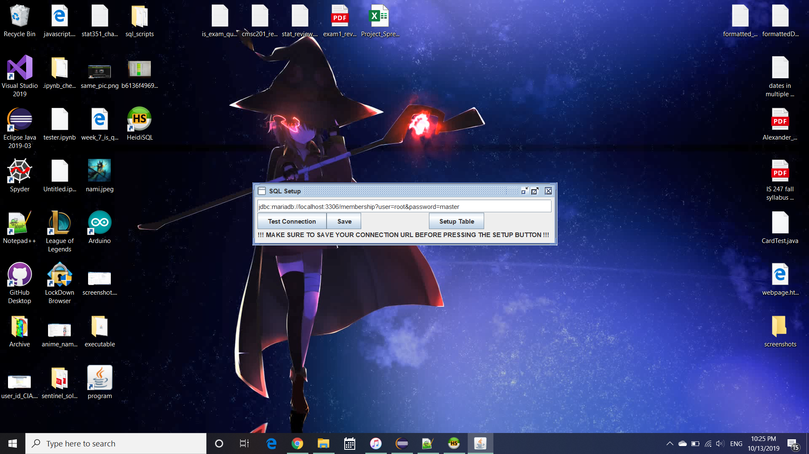
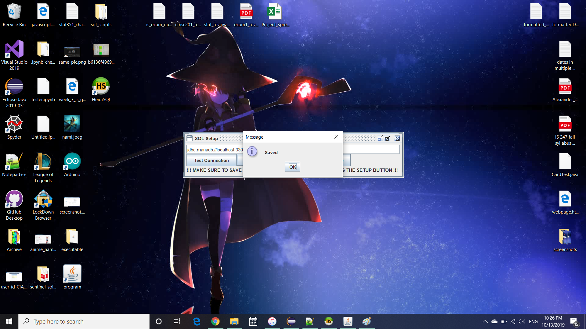
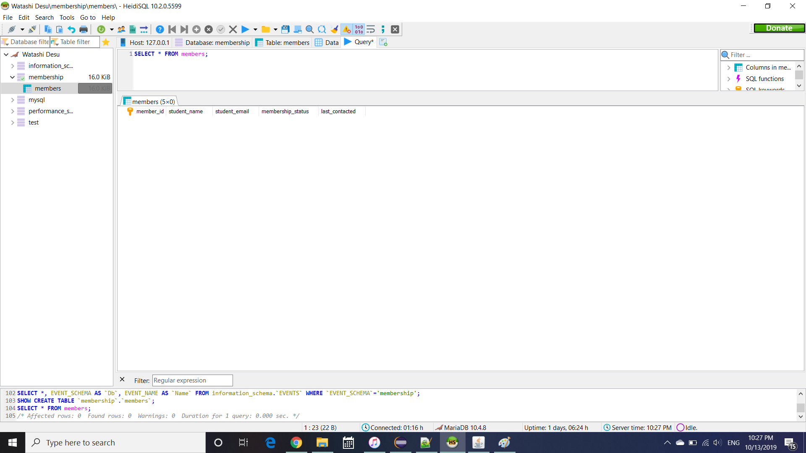

# MariaDB-SQL-Setup
 For UMBC IEEE Automatic Membership Project - SQL Database Setup

Test Connection - Tests the for a connection to the SQL database, using string in text field 
Save - Saves the string in the text field to sql_url.txt 
Setup Table - Runs the command in create_table.sql 

